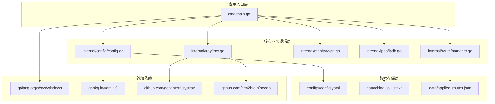
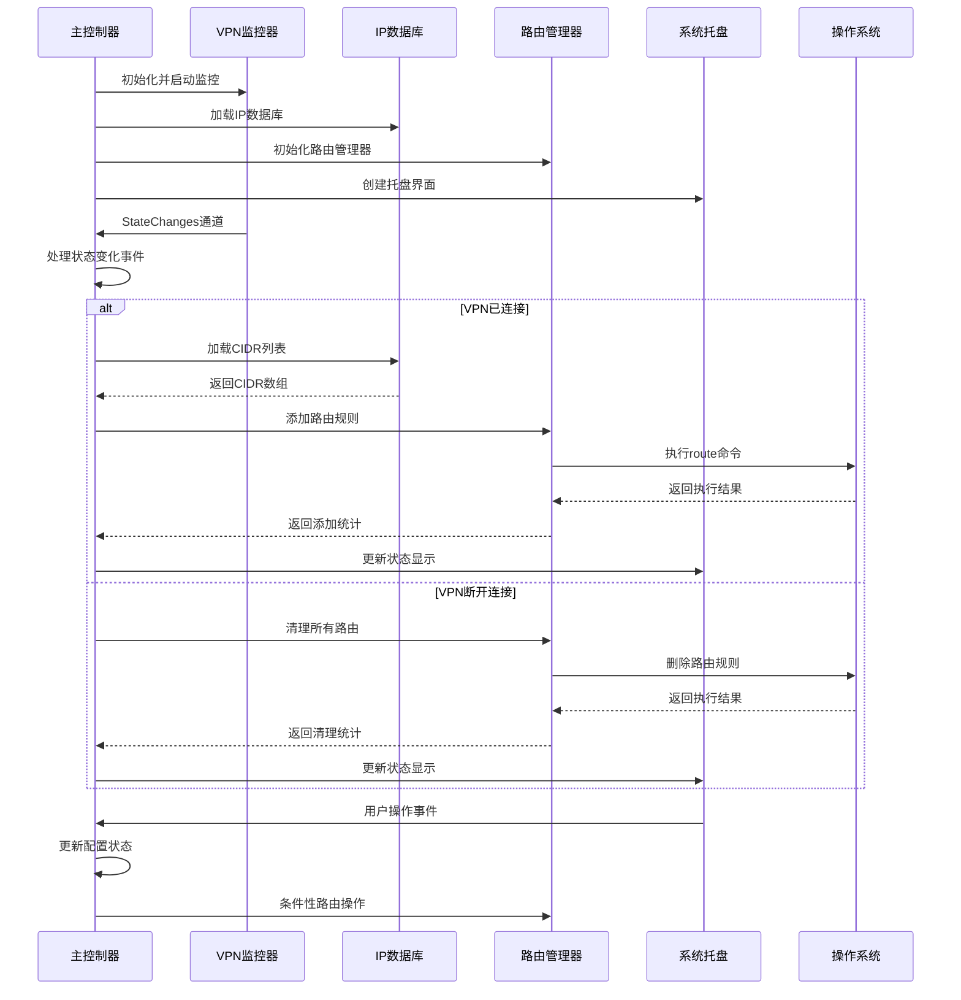
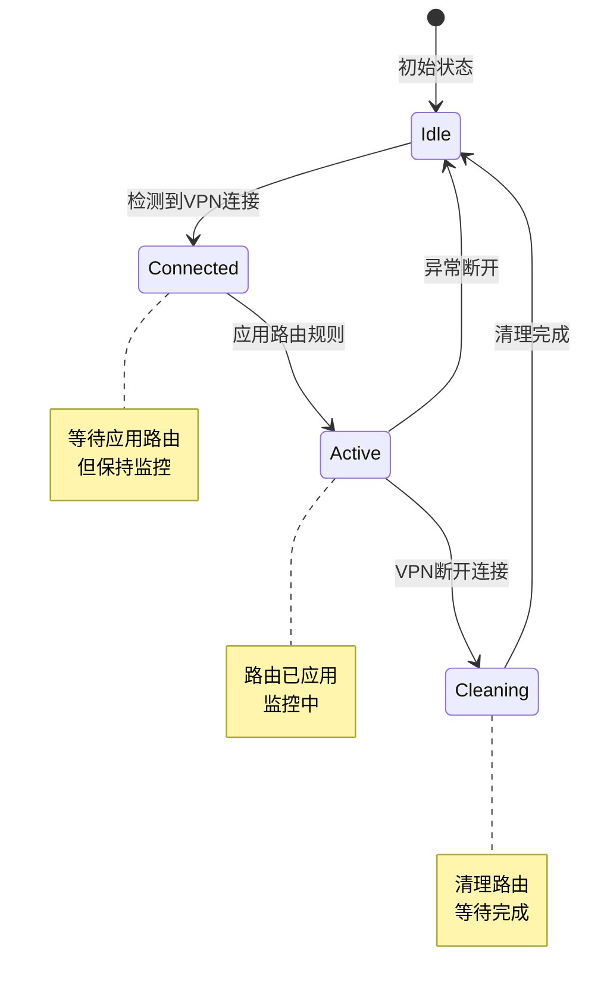
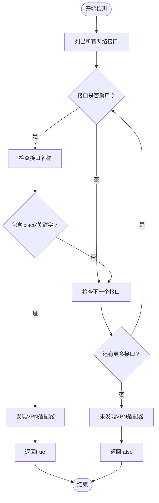
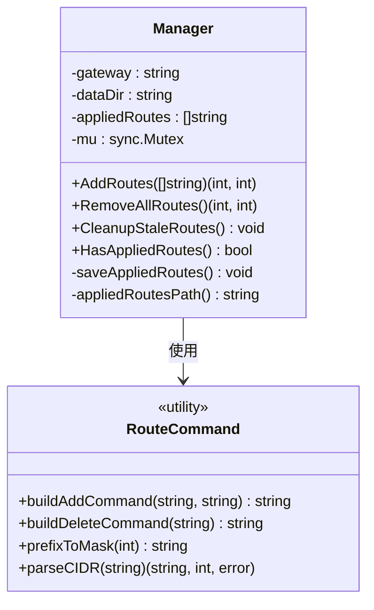
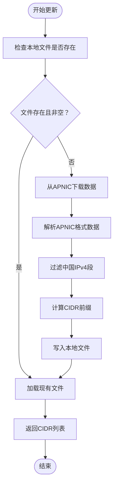
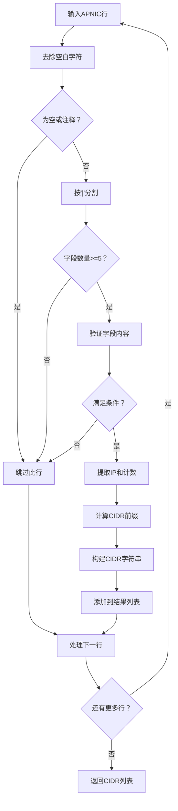
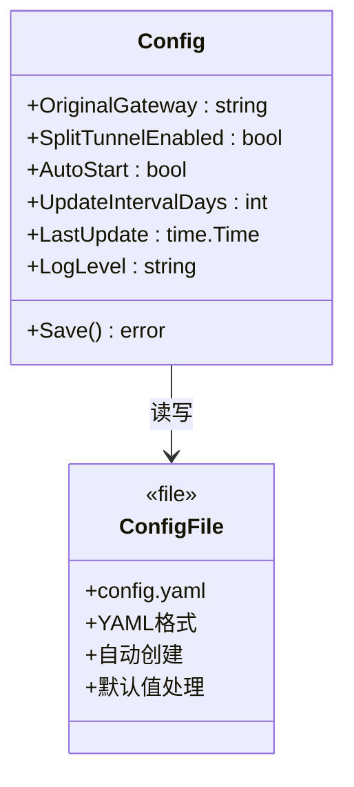
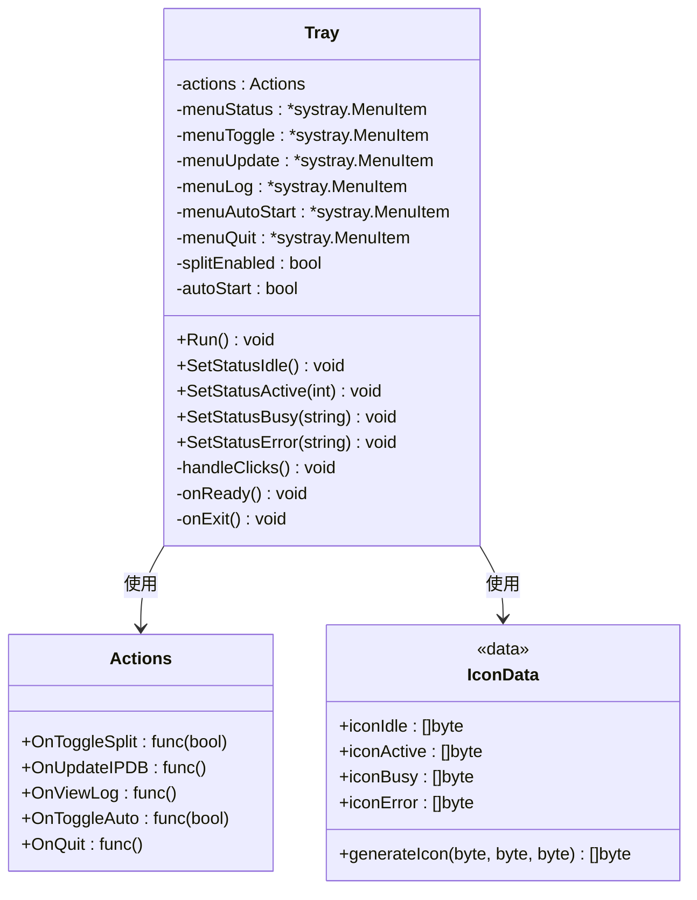
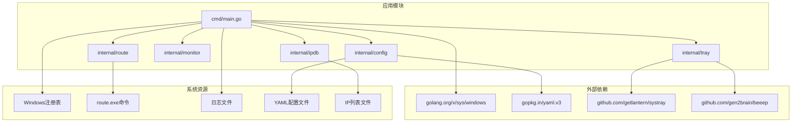

# 核心功能模块

<cite>
**本文档引用的文件**
- [main.go](file://cmd/main.go)
- [config.go](file://internal/config/config.go)
- [ipdb.go](file://internal/ipdb/ipdb.go)
- [vpn.go](file://internal/monitor/vpn.go)
- [manager.go](file://internal/route/manager.go)
- [tray.go](file://internal/tray/tray.go)
- [icon_data.go](file://internal/tray/icon_data.go)
- [config.yaml](file://configs/config.yaml)
- [china_ip_list.txt](file://data/china_ip_list.txt)
- [go.mod](file://go.mod)
</cite>

## 目录
1. [简介](#简介)
2. [项目结构](#项目结构)
3. [核心组件](#核心组件)
4. [架构概览](#架构概览)
5. [详细组件分析](#详细组件分析)
6. [依赖关系分析](#依赖关系分析)
7. [性能考虑](#性能考虑)
8. [故障排除指南](#故障排除指南)
9. [结论](#结论)

## 简介

AnyConnect Split Tunnel 是一个专为 Windows 平台设计的网络路由管理工具，旨在为 Cisco AnyConnect VPN 提供智能分流功能。该工具通过监控 VPN 连接状态，自动管理路由表，将来自特定 IP 段的流量直接路由到本地网络，而其他流量则通过 VPN 隧道传输，从而实现更高效的网络连接。

本项目采用模块化设计，包含六个核心功能模块：VPN 状态监控模块、路由管理模块、IP 数据库管理模块、配置管理模块、系统托盘模块和主控制器模块。这些模块通过事件驱动机制协同工作，形成完整的 Split Tunnel 解决方案。

## 项目结构

项目采用清晰的分层架构，按照功能域进行模块划分：



**图表来源**
- [main.go:74-246](file://cmd/main.go#L74-L246)
- [config.go:1-64](file://internal/config/config.go#L1-L64)
- [ipdb.go:1-117](file://internal/ipdb/ipdb.go#L1-L117)
- [vpn.go:1-144](file://internal/monitor/vpn.go#L1-L144)
- [manager.go:1-129](file://internal/route/manager.go#L1-L129)
- [tray.go:1-130](file://internal/tray/tray.go#L1-L130)

**章节来源**
- [main.go:1-271](file://cmd/main.go#L1-L271)
- [go.mod:1-31](file://go.mod#L1-L31)

## 核心组件

### VPN 状态监控模块
负责实时监控 Cisco AnyConnect VPN 的连接状态变化，通过轮询网络接口来检测 VPN 连接状态，并维护内部状态机以跟踪当前的 VPN 状态。

### 路由管理模块
处理系统路由表的动态管理，包括添加、删除和清理路由规则，确保 Split Tunnel 功能的正确执行。

### IP 数据库管理模块
从 APNIC 服务器下载和解析中国 IP 段数据，提供 IP 地址范围的查询和验证功能。

### 配置管理模块
提供 YAML 配置文件的读写和持久化功能，管理应用程序的各种设置参数。

### 系统托盘模块
实现图形化的用户界面，提供状态显示、菜单操作和通知功能。

### 主控制器模块
协调各个子模块的工作流程，处理事件驱动的业务逻辑。

**章节来源**
- [vpn.go:12-34](file://internal/monitor/vpn.go#L12-L34)
- [manager.go:42-47](file://internal/route/manager.go#L42-L47)
- [ipdb.go:53-59](file://internal/ipdb/ipdb.go#L53-L59)
- [config.go:11-18](file://internal/config/config.go#L11-L18)
- [tray.go:18-28](file://internal/tray/tray.go#L18-L28)
- [main.go:140-183](file://cmd/main.go#L140-L183)

## 架构概览

系统采用事件驱动的架构模式，通过状态机和通道机制实现模块间的解耦通信：



**图表来源**
- [main.go:186-224](file://cmd/main.go#L186-L224)
- [vpn.go:62-76](file://internal/monitor/vpn.go#L62-L76)
- [manager.go:60-79](file://internal/route/manager.go#L60-L79)

### 模块初始化顺序

系统启动时遵循严格的初始化顺序，确保各模块能够正确协作：

1. **权限检查与环境准备**
   - 管理员权限验证
   - 单实例保护
   - 日志文件初始化
   - 桌面快捷方式创建

2. **配置加载与检测**
   - 加载 YAML 配置文件
   - 自动检测原始网关地址
   - 初始化默认配置

3. **数据准备**
   - 初始化 IP 数据库
   - 检查并下载中国 IP 段数据
   - 准备路由管理器

4. **服务启动**
   - 启动 VPN 监控器
   - 清理之前的残留路由
   - 创建系统托盘界面

5. **事件循环**
   - 启动后台任务
   - 进入主事件循环

**章节来源**
- [main.go:74-139](file://cmd/main.go#L74-L139)
- [main.go:179-245](file://cmd/main.go#L179-L245)

## 详细组件分析

### VPN 状态监控模块

VPN 监控模块实现了基于网络接口检测的状态监控机制：

```mermaid
classDiagram
class Monitor {
-state : VPNState
-onChange : chan StateChange
-stop : chan struct{}
-interval : time.Duration
+Start() void
+Stop() void
+State() VPNState
+SetState(VPNState) void
+StateChanges() <-chan StateChange
-pollLoop() void
-detectVPN() bool
}
class StateChange {
+OldState : VPNState
+NewState : VPNState
}
class VPNState {
<<enumeration>>
Idle
Connected
Active
Cleaning
+String() string
}
Monitor --> StateChange : 发送
Monitor --> VPNState : 使用
StateChange --> VPNState : 包含
```

**图表来源**
- [vpn.go:46-51](file://internal/monitor/vpn.go#L46-L51)
- [vpn.go:36-40](file://internal/monitor/vpn.go#L36-L40)
- [vpn.go:12-19](file://internal/monitor/vpn.go#L12-L19)

#### 状态转换机制

VPN 监控器使用有限状态机管理连接状态：



**图表来源**
- [vpn.go:95-104](file://internal/monitor/vpn.go#L95-L104)
- [vpn.go:14-19](file://internal/monitor/vpn.go#L14-L19)

#### 接口检测算法

监控器通过扫描系统网络接口来检测 VPN 连接状态：



**图表来源**
- [vpn.go:109-124](file://internal/monitor/vpn.go#L109-L124)

**章节来源**
- [vpn.go:1-144](file://internal/monitor/vpn.go#L1-L144)

### 路由管理模块

路由管理模块提供了完整的路由表操作功能：



**图表来源**
- [manager.go:42-54](file://internal/route/manager.go#L42-L54)
- [manager.go:15-28](file://internal/route/manager.go#L15-L28)

#### 路由操作流程

路由管理器支持两种主要操作模式：

1. **批量路由添加**
   - 遍历 CIDR 列表
   - 为每个 CIDR 构建路由命令
   - 执行系统命令添加路由
   - 记录成功和失败的统计

2. **批量路由清理**
   - 读取之前保存的路由列表
   - 逐个删除已应用的路由
   - 清空内存中的路由记录

**章节来源**
- [manager.go:60-99](file://internal/route/manager.go#L60-L99)

### IP 数据库管理模块

IP 数据库模块负责从 APNIC 服务器获取和管理中国 IP 段数据：



**图表来源**
- [ipdb.go:81-108](file://internal/ipdb/ipdb.go#L81-L108)

#### 数据解析算法

模块使用专门的解析器处理 APNIC 数据格式：



**图表来源**
- [ipdb.go:20-40](file://internal/ipdb/ipdb.go#L20-L40)

**章节来源**
- [ipdb.go:1-117](file://internal/ipdb/ipdb.go#L1-L117)

### 配置管理模块

配置管理模块提供完整的 YAML 配置文件处理功能：



**图表来源**
- [config.go:11-18](file://internal/config/config.go#L11-L18)
- [config.go:34-50](file://internal/config/config.go#L34-L50)

#### 配置加载流程

配置系统支持多种加载场景：

1. **正常加载**：从 YAML 文件读取配置
2. **文件不存在**：创建默认配置并保存
3. **解析失败**：使用默认配置继续运行
4. **部分字段缺失**：使用默认值填充

**章节来源**
- [config.go:34-63](file://internal/config/config.go#L34-L63)

### 系统托盘模块

系统托盘模块提供了完整的桌面集成功能：



**图表来源**
- [tray.go:18-36](file://internal/tray/tray.go#L18-L36)
- [tray.go:10-16](file://internal/tray/tray.go#L10-L16)
- [icon_data.go:5-8](file://internal/tray/icon_data.go#L5-L8)

#### 状态指示器系统

托盘模块使用四种不同的图标状态来反映系统状态：

| 状态 | 图标颜色 | 描述 | 触发条件 |
|------|----------|------|----------|
| Idle | 灰色 | 空闲状态 | VPN 未连接 |
| Active | 绿色 | 分流生效 | VPN 连接且路由已应用 |
| Busy | 黄色 | 正在处理 | 应用或清理路由中 |
| Error | 红色 | 错误状态 | 操作失败或配置问题 |

**章节来源**
- [tray.go:107-129](file://internal/tray/tray.go#L107-L129)
- [icon_data.go:10-65](file://internal/tray/icon_data.go#L10-L65)

## 依赖关系分析

系统依赖关系清晰明确，采用标准的 Go 模块化设计：



**图表来源**
- [go.mod:5-9](file://go.mod#L5-L9)
- [main.go:14-18](file://cmd/main.go#L14-L18)

### 外部依赖说明

| 依赖包 | 版本 | 用途 | 重要性 |
|--------|------|------|--------|
| golang.org/x/sys | v0.44.0 | Windows 系统调用 | 高 |
| gopkg.in/yaml.v3 | v3.0.1 | YAML 配置解析 | 高 |
| github.com/getlantern/systray | v1.2.2 | 系统托盘界面 | 高 |
| github.com/gen2brain/beeep | v0.11.2 | 桌面通知 | 中 |

**章节来源**
- [go.mod:1-31](file://go.mod#L1-L31)

## 性能考虑

### 内存管理
- 使用互斥锁保护路由操作的并发安全
- 采用延迟加载策略避免不必要的资源占用
- 及时清理临时数据和错误状态

### 网络效率
- VPN 监控采用 2 秒间隔轮询，平衡响应速度和系统负载
- IP 数据库更新采用异步机制，不影响主程序运行
- 路由操作批量执行，减少系统调用次数

### 存储优化
- 路由状态持久化到 JSON 文件，支持崩溃恢复
- IP 数据库缓存到本地文件，减少网络请求
- 配置文件采用增量更新策略

## 故障排除指南

### 常见问题及解决方案

#### VPN 监控失效
**症状**：VPN 连接状态无法正确检测
**可能原因**：
- 网络接口名称不符合预期格式
- 权限不足导致无法访问系统信息
- 网络适配器驱动异常

**解决步骤**：
1. 检查网络适配器名称是否包含 "cisco" 关键字
2. 以管理员权限重新启动程序
3. 更新网络适配器驱动程序

#### 路由添加失败
**症状**：路由规则无法添加到系统
**可能原因**：
- 缺少管理员权限
- 网关地址配置错误
- CIDR 格式不正确

**解决步骤**：
1. 确认程序以管理员权限运行
2. 验证配置文件中的网关地址
3. 检查 IP 数据库文件格式

#### IP 数据库更新失败
**症状**：无法从 APNIC 下载数据
**可能原因**：
- 网络连接问题
- APNIC 服务器暂时不可用
- 防火墙阻止访问

**解决步骤**：
1. 检查网络连接状态
2. 手动尝试访问 APNIC 网站
3. 检查防火墙设置

#### 托盘界面异常
**症状**：系统托盘图标不显示或无响应
**可能原因**：
- systray 库兼容性问题
- 图标数据损坏
- 系统托盘服务异常

**解决步骤**：
1. 重启系统托盘服务
2. 更新 systray 库版本
3. 重新安装应用程序

**章节来源**
- [main.go:198-208](file://cmd/main.go#L198-L208)
- [manager.go:69-72](file://internal/route/manager.go#L69-L72)
- [ipdb.go:82-89](file://internal/ipdb/ipdb.go#L82-L89)

## 结论

AnyConnect Split Tunnel 项目展现了优秀的软件工程实践，通过模块化设计实现了功能的清晰分离和良好的可维护性。各模块职责明确，协作机制完善，为用户提供了一个稳定可靠的网络分流解决方案。

系统的主要优势包括：
- **事件驱动架构**：通过状态机和通道机制实现松耦合的模块通信
- **完善的错误处理**：多层容错机制确保系统稳定性
- **用户友好界面**：简洁直观的托盘界面提供良好的用户体验
- **自动化程度高**：支持自动检测、自动更新和自动启动功能

未来可以考虑的改进方向：
- 增加更多的日志级别和调试选项
- 支持更多的网络适配器类型
- 实现更精细的路由规则管理
- 添加网络性能监控功能